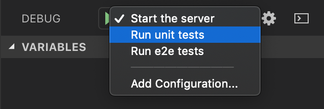

# Visual Studio Code

> *Visual Studio Code is a lightweight but powerful source code editor which runs on your desktop and is available for Windows, macOS and Linux. It comes with built-in support for JavaScript, TypeScript and Node.js.*
>
> Source:  https://code.visualstudio.com/docs

[VS Code](https://code.visualstudio.com/) has become **one of the most popular code editors in the JavaScript ecosystem**. It offers useful features (auto-completion, debugging tools, etc.) that work very well with TypeScript and Node.js. That's why it has a dedicated page in the documentation.

But using VS Code is not mandatory to develop a FoalTS app. So feel free to use another code editor if you prefer.

## Configuring the linting

In order to directly print the ESLint errors in VS Code and auto-fix the problems on save you need to install the `ESLint` extension which can be found in the [Visual Studio Marketplace](https://marketplace.visualstudio.com/items?itemName=dbaeumer.vscode-eslint).

It can be installed by launching VS Code Quick Open (`Ctrl+P` or `Cmd+P`), pasting the following command, and pressing enter:

```
ext install dbaeumer.vscode-eslint
```

Then, you will need to activate it for TypeScript on your settings (`Ctrl+,` or `Cmd+,`):

1. Editing `eslint.validate` so that it has `"typescript"` with `"autoFix": true` by adding this to your `settings.json`:
  ```
  "eslint.validate": [
    { "language": "typescript", "autoFix": true }
  ],
  ```
2. Activating `eslint.autoFixOnSave` if you want it to auto fix when you save (keep in mind it doesn't work with `files.autoSave` set to `afterDelay`).

## Debugging with VS Code

Run the following command to create the suitable debug config files.

```
foal generate vscode-config
```

Now you can add a breakpoint in your code and start the app in debug mode.


The generated files also include configurations to run your unit and end-to-end tests (available since v1.0.0).


